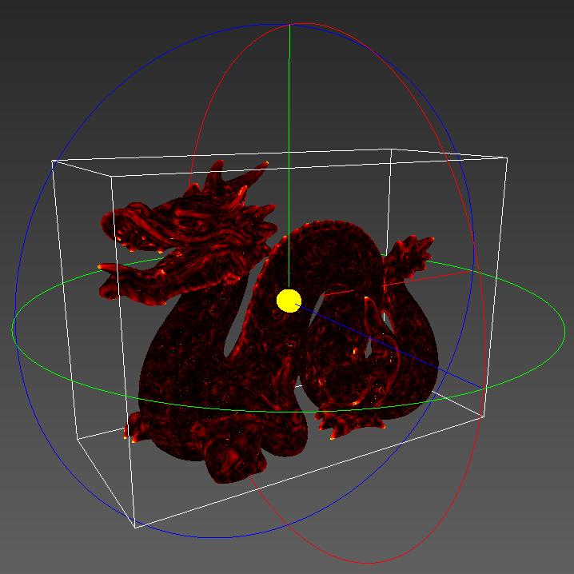

Industrial 3D Scanning
===

Welcome to the documentation of the team project programming task of the
lecture 'Industrial 3D Scanning' (WiSe 2017/2018).

Below you see an impression of the program that was developed during the
course. It shows an image of the Stanford Dragon, rendered as a point cloud.
The color represents the distance between the original point cloud and a
smoothed version that is displayed here.

